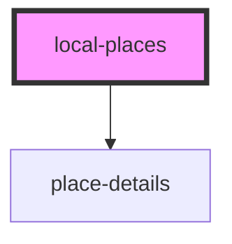

# local-places

<!-- Auto Generated Below -->

## Properties

| Property    | Attribute   | Description | Type     | Default     |
| ----------- | ----------- | ----------- | -------- | ----------- |
| `latitude`  | `latitude`  |             | `number` | `undefined` |
| `longitude` | `longitude` |             | `number` | `undefined` |

## Dependencies

### Depends on

- [place-details](../place-details)

### Graph

----------------------------------------------

*Built with [StencilJS](https://stenciljs.com/)*
