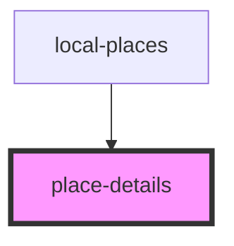

# place-details

<!-- Auto Generated Below -->

## Properties

| Property | Attribute | Description | Type                                                                                   | Default     |
| -------- | --------- | ----------- | -------------------------------------------------------------------------------------- | ----------- |
| `pageId` | `pageid`  |             | `string`                                                                               | `undefined` |
| `place`  | --        |             | `{ PlaceProps: Place; PageText: string; Wikipedia: WikipediaData; imageUrl: string; }` | `undefined` |

## Events

| Event         | Description | Type               |
| ------------- | ----------- | ------------------ |
| `detailClose` |             | `CustomEvent<any>` |

## Dependencies

### Used by

 - [local-places](../local-places)

### Graph

----------------------------------------------

*Built with [StencilJS](https://stenciljs.com/)*
