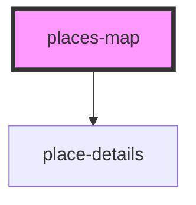

# places-map

<!-- Auto Generated Below -->

## Methods

### `getMap() => Promise<Map>`

#### Returns

Type: `Promise<Map>`

## Dependencies

### Depends on

- [place-details](../place-details)

### Graph

----------------------------------------------

*Built with [StencilJS](https://stenciljs.com/)*
